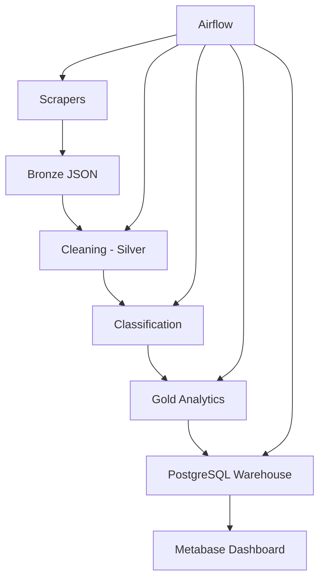

# Architecture Diagram

```mermaid
graph TD
  A[Scrapers] --> B[Bronze JSON]
  B --> C[Cleaning - Silver]
  C --> D[Classification]
  D --> E[Gold Analytics]
  E --> F[PostgreSQL Warehouse]
  F --> G[Metabase Dashboard]
  H[Airflow] --> A
  H --> C
  H --> D
  H --> E
  H --> F
```
